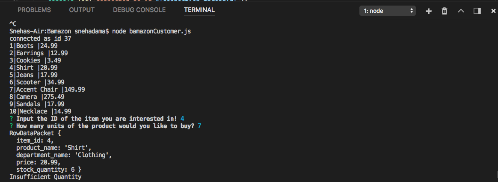
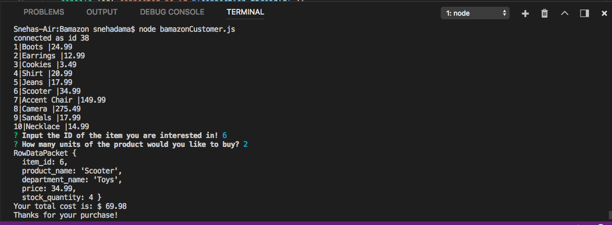
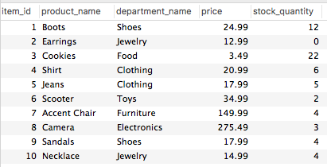

# Bamazon
Bamazon is an Amazon-like storefront utilizing MySQL and Node.js. This application will take in orders from customers and deplete stock from the store's inventory. 

# Customer Side Application

The customer side of the application runs by the following steps:

1. Populating a table with each product's item id, product name, and product price.

2. The user then gets prompted with what item they would like to select and how many. 

3. If the store does not have enough of the item in stock, the message "Insufficient Quantity" will pop up.

4. If the store has the amount reuqested in stock, the user will receive "Purchase Success" notification along with a total cost of their purchase. 

5. The database will be updated as well! As you can see, the product item number 6 is now reduced from originally 4 items in stock to 2. 

